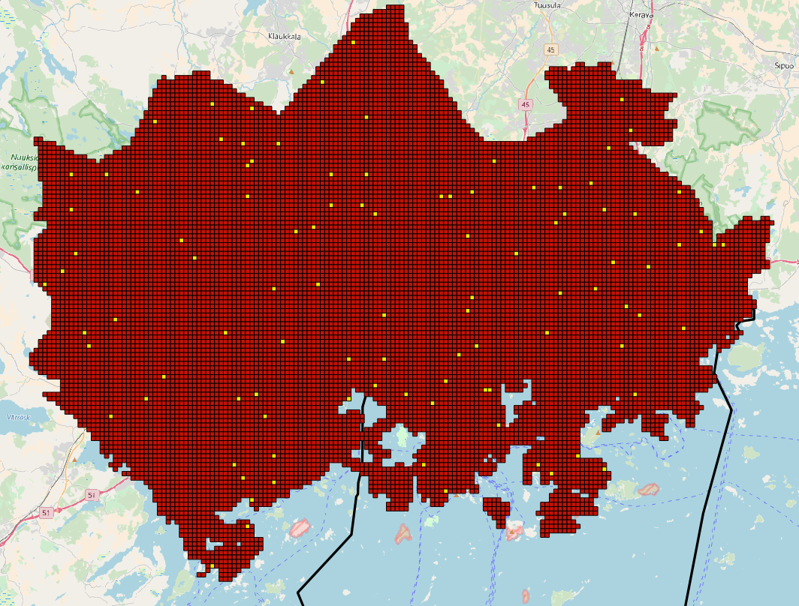

# Car routing differences between MetropAccess-Digiroad-tool and DORA

To run the comparison between the old ArcGIS -based MetropAccess-Digiroad-tool and the DORA, we used the more than 13000 grid-cells versus 5 samples of those points (green points) located in different regions of the area of study. See below. 

![TestPoint][TestPointImage]

## Test data

 - [Test_Points_MetropA_Digiroad.geojson](test_data/Test_Points_MetropA_Digiroad.geojson)
    - The testpoints are the centroids of the grid squares that were sampled from MetropAccess grid using a random sample (n=100). 

Locations of the MetropAccess Digiroad quality test points.

## Results

As a result we have the following matrices for each of the points:
* Negative values indicate that the new tool found faster routes than the old one and positives values that the new tool found slower routes.

### 1st Point

![MatrixDifference][MatrixDifferenceImage1]

| Statistic        | Value           | 
| ------------- |:-------------:| 
| Count      | 13060 | 
| Sum      | 5794.25      | 
| Mean | 0.443664      | 
| Median | 0.312606      |
| St dev (pop) | 2.36106      |
| St dev (sample) | 2.36115      |
| Minimum | -20.349      |
| Maximum | 22.4493      |
| Range | 42.7983      |

![MatrixError1][MatrixErrorImage1]

The image above illustrates that 81.5% of the routes lies within the interval [-2,2].

### 2nd Point

![MatrixDifference2][MatrixDifferenceImage2]

| Statistic        | Value           | 
| ------------- |:-------------:| 
| Count      | 13063 | 
| Sum      | 1898.22      | 
| Mean | 0.145313      | 
| Median | -0.00556461      |
| St dev (pop) | 2.48739      |
| St dev (sample) | 2.48748      |
| Minimum | -19.1477      |
| Maximum | 29.0453      |
| Range | 48.193      |

![MatrixError2][MatrixErrorImage2]

In this case, the routes laying within the [-2,2] interval are the 82,2%.  

### 3rd Point

![MatrixDifference3][MatrixDifferenceImage3]

| Statistic        | Value           | 
| ------------- |:-------------:| 
| Count      | 13063 | 
| Sum      | -10996.7      | 
| Mean | -0.841819      | 
| Median | -0.881958      |
| St dev (pop) | 2.4286      |
| St dev (sample) | 2.42869      |
| Minimum | -21.6055      |
| Maximum | 27.0001      |
| Range | 48.6056      |

![MatrixError3][MatrixErrorImage3]

For the third case, the 72,8% of the routes are within the interval [-2,2].

### 4th Point

![MatrixDifference4][MatrixDifferenceImage4]

| Statistic        | Value           | 
| ------------- |:-------------:| 
| Count      | 13063 | 
| Sum      | 704.86      | 
| Mean | 0.0539585      | 
| Median | -0.166775      |
| St dev (pop) | 2.22304      |
| St dev (sample) | 2.22312      |
| Minimum | -19.5466      |
| Maximum | 27.1639      |
| Range | 46.7105      |

![MatrixError4][MatrixErrorImage4]

85,7% of the routes are within the intervals [-2,2]

### 5th Point

![MatrixDifference5][MatrixDifferenceImage5]

| Statistic        | Value           | 
| ------------- |:-------------:| 
| Count      | 13063 | 
| Sum      | -19361.5      | 
| Mean | -1.48217      | 
| Median | -1.46078      |
| St dev (pop) | 2.66217      |
| St dev (sample) | 2.66227      |
| Minimum | -20.9835      |
| Maximum | 24.2891      |
| Range | 45.2725      |

![MatrixError5][MatrixErrorImage5]

Whereas in this last test case, only the 60,5% of the routes are within in the same interval [-2,2].

#### 5th Point: shortest path from faster areas

In order to analyze why routes going to the city center are faster in certain regions, we chose 6 random points and calculated the shortest path to those points. See the result below.

![ShortestPathRautatientori][ShortestPathRautatientoriImage]

Then, we calculated the shortest path for those points using the ArcGIS network analysis as was done with the previous approach.

These are the resulting routes:

![ShortestPathRautatientoriArcGIS][ShortestPathRautatientoriArcGISImage]
 
Overlapping the resulting routes from both tools we have:
 
![ShortestPathRautatientoriComparison][ShortestPathRautatientoriComparisonImage]
 
Main differences are found at the beginning of the route, where both algorithms find different nearest routable vertices, as it is depicted in the previous image.
 
![nearestVertexRautatientori][nearestVertexRautatientoriImage]  

Similarly happens with the end point in Rautatientori, where it is evident that ArcGIS takes a point that intersects the road segment as the nearest point to start the routing analysis, whereas pgRouting needs the true vertex from that segment of the road to calculate the shortest path. Given this situation, the euclidean distance may vary from tool to tool, where for the pgRouting tool the nearest vertex from the starting and ending point is further than for the ArcGIS NA vertex.

Additionally, we found that the road network dataset, that was used in this (and the old Metrop-Access tool development) analysis has some discrepancies in the directionality of some road segments that are the cause of some wrong routing results, as it is evident in the junction of the previous images. The next figures illustrate that a portion of the road has a wrong directionality (Seems to be caused by the order of the points in which the LineString was created, which are in the opposite direction to its adjacent LineStrings):

![roadSegmentWellRouted][roadSegmentWellRoutedImage]
![roadSegmentNOTWellRouted][roadSegmentNOTWellRoutedImage]

The yellow point is the **starting point**, all the other points are possible destinations. We can see that the algorithm is able to find a correct route to the points that are below the starting point given the road directionality, but do not happen the same with the point above, in which in normal cases, had had to follow a path going downwards on the road, find a turn, go straight up and find another turn to reach the final destination, but in this case, the algorithm found a route heading upwards directly to the end point, which it is wrong.    
 

[TestPointImage]: datapoints.PNG
[MatrixDifferenceImage1]: matrixDifferenceImage1-5920413.png
[MatrixDifferenceImage2]: matrixDifferenceImage2-5878018.png
[MatrixDifferenceImage3]: matrixDifferenceImage3-5870644.png
[MatrixDifferenceImage4]: matrixDifferenceImage4-5963599.png 
[MatrixDifferenceImage5]: matrixDifferenceImage5-5973738.png

[MatrixErrorImage1]: matrixIntervalImage1-5920413.png
[MatrixErrorImage2]: matrixIntervalImage2-5878018.png
[MatrixErrorImage3]: matrixIntervalImage3-5870644.png
[MatrixErrorImage4]: matrixIntervalImage4-5963599.png
[MatrixErrorImage5]: matrixIntervalImage5-5973738.png

[ShortestPathRautatientoriImage]: sampleRoutesToRautatientori.png
[ShortestPathRautatientoriArcGISImage]: sampleRoutesToRautatientoriArcGIS.png
[ShortestPathRautatientoriComparisonImage]: sampleRoutesToRautatientoriComparison.png
[nearestVertexRautatientoriImage]: nearestVertexRautatientori.png
[roadSegmentWellRoutedImage]: road-segment-well-routed.png
[roadSegmentNOTWellRoutedImage]: road-segment-NOT-well-routed.png
